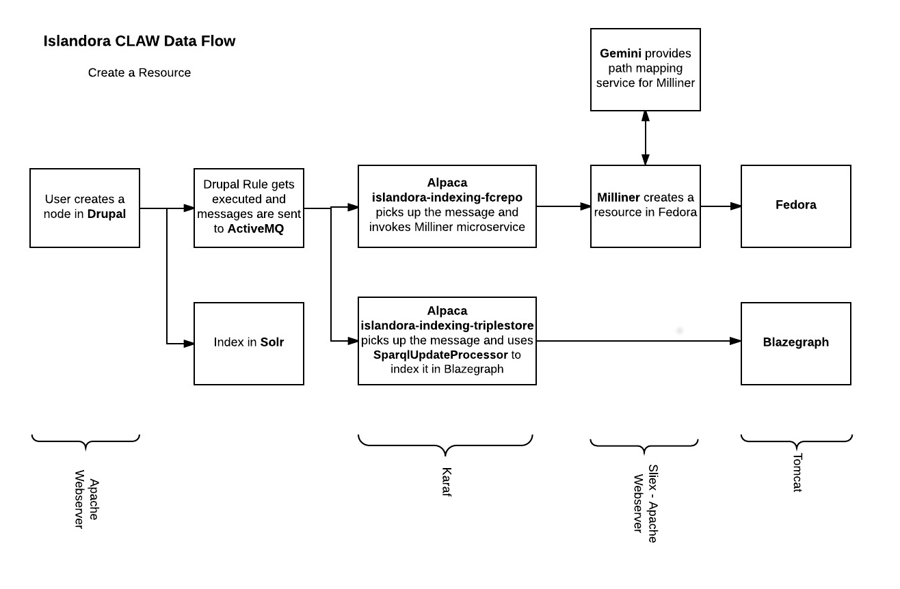

* User creates a node in Drupal.

* Drupal Rules get executed (`islandora/src/Plugin/RulesAction/Broadcaster.php`) and a create event message gets posted to  the `islandora-indexing-fcrepo-content` queue in the ActiveMQ.  Another message is posted to the `islandora-indexing-triplestore-index` queue.

```
IslandoraBroadcastRecipients:activemq\cqueue\cislandora-indexing-fcrepo-create,activemq\cqueue\cislandora-indexing-triplestore Authorization:Bearer Authorization Token @"@context":"https:\/\/www.w3.org\/ns\/activitystreams","type":"Create","actor":{"type":"Person","id":"http:\/\/dsu-beta.utsc.utoronto.ca:8000\/user\/1","object":"http:\/\/dsu-beta.utsc.utoronto.ca:8000\/node\/49"}
```

* Alpaca  islandora-indexing-fcrepo picks up the message from the `islandora-indexing-fcrepo-content` queue and invokes Milliner microservice in FcrepoIndexer.java.  Note that `content.stream` is mapped to `islandora-indexing-fcrepo-content` in the Alpaca config.

```java
        from("{{content.stream}}")
                .routeId("FcrepoIndexerContent")
                .removeHeaders("*", "Authorization")
                .setHeader(Exchange.CONTENT_TYPE, constant("application/ld+json"))
                .setHeader(Exchange.HTTP_METHOD, constant("POST"))
        .toD(getMillinerBaseUrl() + "content");
```

* Alpaca  islandora-indexing-triplestore picks up the message and uses SparqlUpdateProcessor to index it in Blazegraph.

* Milliner creates a resource in Fedora.

* Gemini provides path mapping service for Milliner.
